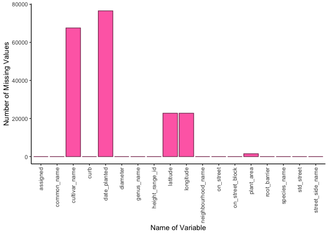
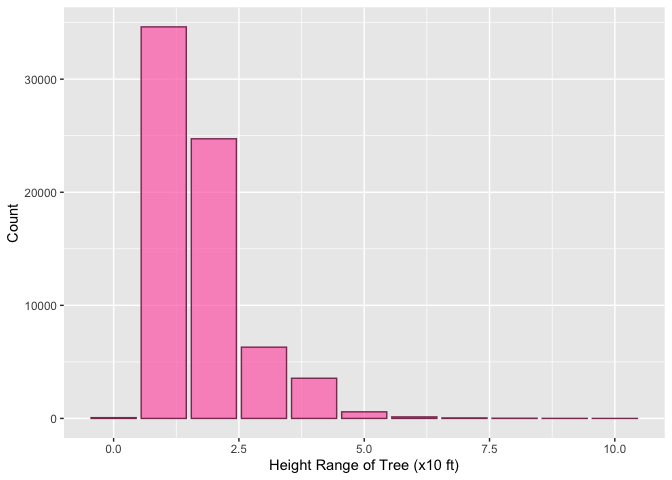
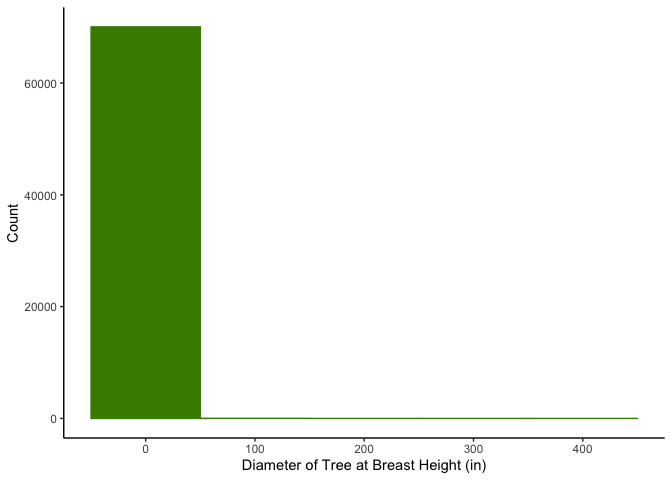
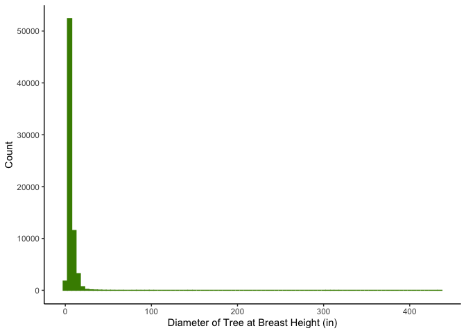
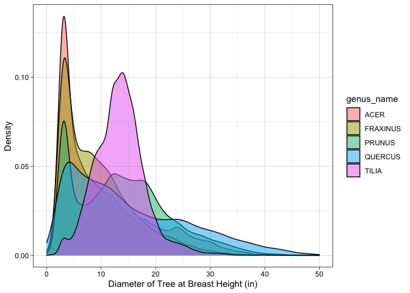
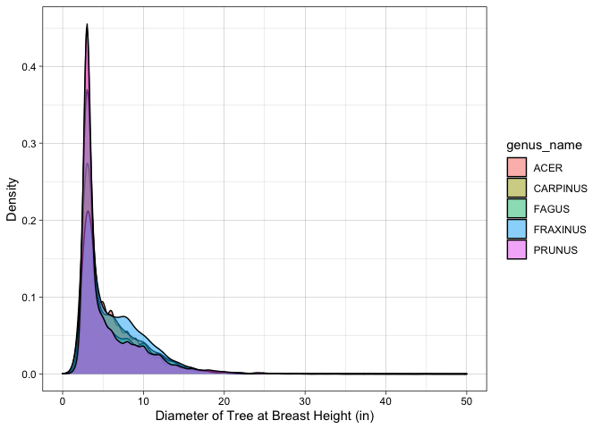
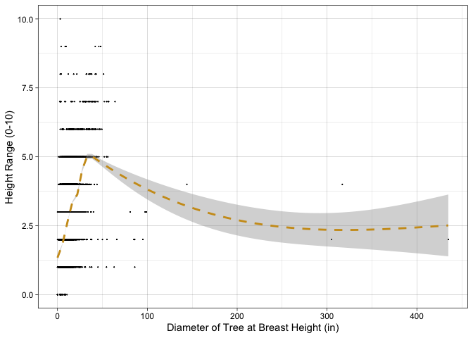

Mini Data-Analysis Deliverable 1
================

# Welcome to your (maybe) first-ever data analysis project!

And hopefully the first of many. Let’s get started:

1.  Install the [`datateachr`](https://github.com/UBC-MDS/datateachr)
    package by typing the following into your **R terminal**:

<!-- -->

    install.packages("devtools")
    devtools::install_github("UBC-MDS/datateachr")

2.  Load the packages below.

``` r
library(datateachr)
library(tidyverse)
```

    ## ── Attaching packages ─────────────────────────────────────── tidyverse 1.3.2 ──
    ## ✔ ggplot2 3.3.6      ✔ purrr   0.3.5 
    ## ✔ tibble  3.1.8      ✔ dplyr   1.0.10
    ## ✔ tidyr   1.2.1      ✔ stringr 1.4.1 
    ## ✔ readr   2.1.3      ✔ forcats 0.5.2 
    ## ── Conflicts ────────────────────────────────────────── tidyverse_conflicts() ──
    ## ✖ dplyr::filter() masks stats::filter()
    ## ✖ dplyr::lag()    masks stats::lag()

3.  Make a repository in the <https://github.com/stat545ubc-2022>
    Organization. You will be working with this repository for the
    entire data analysis project. You can either make it public, or make
    it private and add the TA’s and Lucy as collaborators. A link to
    help you create a private repository is available on the
    \#collaborative-project Slack channel.

# Instructions

## For Both Milestones

-   Each milestone is worth 45 points. The number of points allocated to
    each task will be annotated within each deliverable. Tasks that are
    more challenging will often be allocated more points.

-   10 points will be allocated to the reproducibility, cleanliness, and
    coherence of the overall analysis. While the two milestones will be
    submitted as independent deliverables, the analysis itself is a
    continuum - think of it as two chapters to a story. Each chapter, or
    in this case, portion of your analysis, should be easily followed
    through by someone unfamiliar with the content.
    [Here](https://swcarpentry.github.io/r-novice-inflammation/06-best-practices-R/)
    is a good resource for what constitutes “good code”. Learning good
    coding practices early in your career will save you hassle later on!

## For Milestone 1

**To complete this milestone**, edit [this very `.Rmd`
file](https://raw.githubusercontent.com/UBC-STAT/stat545.stat.ubc.ca/master/content/mini-project/mini-project-1.Rmd)
directly. Fill in the sections that are tagged with
`<!--- start your work below --->`.

**To submit this milestone**, make sure to knit this `.Rmd` file to an
`.md` file by changing the YAML output settings from
`output: html_document` to `output: github_document`. Commit and push
all of your work to the mini-analysis GitHub repository you made
earlier, and tag a release on GitHub. Then, submit a link to your tagged
release on canvas.

**Points**: This milestone is worth 45 points: 43 for your analysis, 1
point for having your Milestone 1 document knit error-free, and 1 point
for tagging your release on Github.

# Learning Objectives

By the end of this milestone, you should:

-   Become familiar with your dataset of choosing
-   Select 4 questions that you would like to answer with your data
-   Generate a reproducible and clear report using R Markdown
-   Become familiar with manipulating and summarizing your data in
    tibbles using `dplyr`, with a research question in mind.

# Task 1: Choose your favorite dataset (10 points)

The `datateachr` package by Hayley Boyce and Jordan Bourak currently
composed of 7 semi-tidy datasets for educational purposes. Here is a
brief description of each dataset:

-   *apt_buildings*: Acquired courtesy of The City of Toronto’s Open
    Data Portal. It currently has 3455 rows and 37 columns.

-   *building_permits*: Acquired courtesy of The City of Vancouver’s
    Open Data Portal. It currently has 20680 rows and 14 columns.

-   *cancer_sample*: Acquired courtesy of UCI Machine Learning
    Repository. It currently has 569 rows and 32 columns.

-   *flow_sample*: Acquired courtesy of The Government of Canada’s
    Historical Hydrometric Database. It currently has 218 rows and 7
    columns.

-   *parking_meters*: Acquired courtesy of The City of Vancouver’s Open
    Data Portal. It currently has 10032 rows and 22 columns.

-   *steam_games*: Acquired courtesy of Kaggle. It currently has 40833
    rows and 21 columns.

-   *vancouver_trees*: Acquired courtesy of The City of Vancouver’s Open
    Data Portal. It currently has 146611 rows and 20 columns.

**Things to keep in mind**

-   We hope that this project will serve as practice for carrying our
    your own *independent* data analysis. Remember to comment your code,
    be explicit about what you are doing, and write notes in this
    markdown document when you feel that context is required. As you
    advance in the project, prompts and hints to do this will be
    diminished - it’ll be up to you!

-   Before choosing a dataset, you should always keep in mind **your
    goal**, or in other ways, *what you wish to achieve with this data*.
    This mini data-analysis project focuses on *data wrangling*,
    *tidying*, and *visualization*. In short, it’s a way for you to get
    your feet wet with exploring data on your own.

And that is exactly the first thing that you will do!

1.1 Out of the 7 datasets available in the `datateachr` package, choose
**4** that appeal to you based on their description. Write your choices
below:

**Note**: We encourage you to use the ones in the `datateachr` package,
but if you have a dataset that you’d really like to use, you can include
it here. But, please check with a member of the teaching team to see
whether the dataset is of appropriate complexity. Also, include a
**brief** description of the dataset here to help the teaching team
understand your data.

<!-------------------------- Start your work below ---------------------------->

## **<span style="color: purple;">My 4 Potential DataSet Choices</span>**

1.  cancer_sample
2.  vancouver_trees
3.  steam_games
4.  parking_meters
    <!----------------------------------------------------------------------------->

1.2 One way to narrowing down your selection is to *explore* the
datasets. Use your knowledge of dplyr to find out at least *3*
attributes about each of these datasets (an attribute is something such
as number of rows, variables, class type…). The goal here is to have an
idea of *what the data looks like*.

*Hint:* This is one of those times when you should think about the
cleanliness of your analysis. I added a single code chunk for you below,
but do you want to use more than one? Would you like to write more
comments outside of the code chunk?

<!-------------------------- Start your work below ---------------------------->

## **<span style="color: purple;">Determining the attributes of my potential datasets</span>**

The 4 code chunks below explore the attributes of my 4 potential
datasets. The 4 attributes investigated are the following: class, number
of observations (rows), number of variables (columns), names of all
variables. To finish this exploration, the first 5 rows of each dataset
will be displayed!

**The code below explores the attributes of the <span
style="color: blue;">*cancer_sample*</span> dataset.** Based on the
results below, the cancer_sample dataset is a tibble with 569 rows and
32 columns. These columns (variables) are of the following types:
character & double-precision floating point number.

``` r
class(cancer_sample)
```

    ## [1] "spec_tbl_df" "tbl_df"      "tbl"         "data.frame"

``` r
dim(cancer_sample)
```

    ## [1] 569  32

``` r
glimpse(cancer_sample, 5)
```

    ## Rows: 569
    ## Columns: 32
    ## $ ID                      <dbl> …
    ## $ diagnosis               <chr> …
    ## $ radius_mean             <dbl> …
    ## $ texture_mean            <dbl> …
    ## $ perimeter_mean          <dbl> …
    ## $ area_mean               <dbl> …
    ## $ smoothness_mean         <dbl> …
    ## $ compactness_mean        <dbl> …
    ## $ concavity_mean          <dbl> …
    ## $ concave_points_mean     <dbl> …
    ## $ symmetry_mean           <dbl> …
    ## $ fractal_dimension_mean  <dbl> …
    ## $ radius_se               <dbl> …
    ## $ texture_se              <dbl> …
    ## $ perimeter_se            <dbl> …
    ## $ area_se                 <dbl> …
    ## $ smoothness_se           <dbl> …
    ## $ compactness_se          <dbl> …
    ## $ concavity_se            <dbl> …
    ## $ concave_points_se       <dbl> …
    ## $ symmetry_se             <dbl> …
    ## $ fractal_dimension_se    <dbl> …
    ## $ radius_worst            <dbl> …
    ## $ texture_worst           <dbl> …
    ## $ perimeter_worst         <dbl> …
    ## $ area_worst              <dbl> …
    ## $ smoothness_worst        <dbl> …
    ## $ compactness_worst       <dbl> …
    ## $ concavity_worst         <dbl> …
    ## $ concave_points_worst    <dbl> …
    ## $ symmetry_worst          <dbl> …
    ## $ fractal_dimension_worst <dbl> …

**The code below explores the attributes of the <span
style="color: blue;">*vancouver_trees*</span> dataset.** Based on the
results below, the vancouver_trees dataset is a tibble with 70,063 rows
and 22 columns. These columns (variables) are of the following types:
character, double-precision floating point number & date.

``` r
class(vancouver_trees)
```

    ## [1] "tbl_df"     "tbl"        "data.frame"

``` r
dim(vancouver_trees)
```

    ## [1] 146611     20

``` r
glimpse(vancouver_trees, 5)
```

    ## Rows: 146,611
    ## Columns: 20
    ## $ tree_id            <dbl> …
    ## $ civic_number       <dbl> …
    ## $ std_street         <chr> …
    ## $ genus_name         <chr> …
    ## $ species_name       <chr> …
    ## $ cultivar_name      <chr> …
    ## $ common_name        <chr> …
    ## $ assigned           <chr> …
    ## $ root_barrier       <chr> …
    ## $ plant_area         <chr> …
    ## $ on_street_block    <dbl> …
    ## $ on_street          <chr> …
    ## $ neighbourhood_name <chr> …
    ## $ street_side_name   <chr> …
    ## $ height_range_id    <dbl> …
    ## $ diameter           <dbl> …
    ## $ curb               <chr> …
    ## $ date_planted       <date> …
    ## $ longitude          <dbl> …
    ## $ latitude           <dbl> …

**The code below explores the attributes of the <span
style="color: blue;">*steam_games*</span> dataset.** Based on the
results below, the vancouver_trees dataset is a tibble with 40,833 rows
and 21 columns. These columns (variables) are of the following types:
character & double-precision floating point number.

``` r
class(steam_games)
```

    ## [1] "spec_tbl_df" "tbl_df"      "tbl"         "data.frame"

``` r
dim(steam_games)
```

    ## [1] 40833    21

``` r
glimpse(steam_games, 5)
```

    ## Rows: 40,833
    ## Columns: 21
    ## $ id                       <dbl> …
    ## $ url                      <chr> …
    ## $ types                    <chr> …
    ## $ name                     <chr> …
    ## $ desc_snippet             <chr> …
    ## $ recent_reviews           <chr> …
    ## $ all_reviews              <chr> …
    ## $ release_date             <chr> …
    ## $ developer                <chr> …
    ## $ publisher                <chr> …
    ## $ popular_tags             <chr> …
    ## $ game_details             <chr> …
    ## $ languages                <chr> …
    ## $ achievements             <dbl> …
    ## $ genre                    <chr> …
    ## $ game_description         <chr> …
    ## $ mature_content           <chr> …
    ## $ minimum_requirements     <chr> …
    ## $ recommended_requirements <chr> …
    ## $ original_price           <dbl> …
    ## $ discount_price           <dbl> …

**The code below explores the attributes of the <span
style="color: blue;">*parking_meters*</span> dataset.** Based on the
results below, the vancouver_trees dataset is a tibble with 10032 rows
and 22 columns. These columns (variables) are of the following types:
character & double-precision floating point number.

``` r
class(parking_meters)
```

    ## [1] "tbl_df"     "tbl"        "data.frame"

``` r
dim(parking_meters)
```

    ## [1] 10032    22

``` r
glimpse(parking_meters, 5)
```

    ## Rows: 10,032
    ## Columns: 22
    ## $ meter_head     <chr> …
    ## $ r_mf_9a_6p     <chr> …
    ## $ r_mf_6p_10     <chr> …
    ## $ r_sa_9a_6p     <chr> …
    ## $ r_sa_6p_10     <chr> …
    ## $ r_su_9a_6p     <chr> …
    ## $ r_su_6p_10     <chr> …
    ## $ rate_misc      <chr> …
    ## $ time_in_effect <chr> …
    ## $ t_mf_9a_6p     <chr> …
    ## $ t_mf_6p_10     <chr> …
    ## $ t_sa_9a_6p     <chr> …
    ## $ t_sa_6p_10     <chr> …
    ## $ t_su_9a_6p     <chr> …
    ## $ t_su_6p_10     <chr> …
    ## $ time_misc      <chr> …
    ## $ credit_card    <chr> …
    ## $ pay_phone      <chr> …
    ## $ longitude      <dbl> …
    ## $ latitude       <dbl> …
    ## $ geo_local_area <chr> …
    ## $ meter_id       <chr> …

<!----------------------------------------------------------------------------->

1.3 Now that you’ve explored the 4 datasets that you were initially most
interested in, let’s narrow it down to 2. What lead you to choose these
2? Briefly explain your choices below, and feel free to include any code
in your explanation.

<!-------------------------- Start your work below ---------------------------->

## **<span style="color: purple;">Narrowing it down to 2 datasets</span>**

After giving it much thought, I have narrowed my options down to the
following 2 datasets:

1.  **<span style="color: blue;">cancer_sample:</span>** I have chosen
    this dataset purely out of interest and relevance. I am a graduate
    student in the Department of Microbiology & Immunology and my
    supervisor’s lab is based at BCCHR. As such, my graduate thesis
    project is heavily reliant on the ability to work with and
    manipulate healthcare data. For this reason, I believe that the
    cancer_sample dataset is most similar to the datasets I will be
    working on in the future, and, thus, a good dataset for me to ‘get
    my feet wet’!

2.  **<span style="color: blue;">vancouver_trees:</span>** I chose this
    dataset because it has the greatest number of observations(rows) out
    of the 7 given datasets. Datasets with a large number of
    observations(rows) are generally preferred for statistical analysis
    because they usually have a higher statistical power and, thus,
    better predictive capabilities. I also find this dataset very
    interesting because it’ll allow me to explore topics that I normally
    wouldn’t have the time/opportunity to investigate.
    <!----------------------------------------------------------------------------->

1.4 Time for the final decision! Going back to the beginning, it’s
important to have an *end goal* in mind. For example, if I had chosen
the `titanic` dataset for my project, I might’ve wanted to explore the
relationship between survival and other variables. Try to think of 1
research question that you would want to answer with each dataset. Note
them down below, and make your final choice based on what seems more
interesting to you!

<!-------------------------- Start your work below ---------------------------->

## **<span style="color: purple;">Final Decision Regarding Which DataSet To Explore Further</span>**

In an attempt to decide on a dataset between the 2 listed previously, I
have chosen 1 research question for each dataset. The research questions
are as follows:

1.  **<span style="color: blue;">cancer_sample:</span>** Do cell nuclei
    classified as malignant have a greater, smaller, or equal radius
    compared to those classified as benign?
2.  **<span style="color: blue;">vancouver_trees:</span>** On average,
    during which month of the year are the most trees planted in
    Vancouver?

<span style="color: limegreen;">**Based on the questions listed above, I
have decided to explore the *vancouver_trees* dataset further.**</span>
<!----------------------------------------------------------------------------->

# Important note

Read Tasks 2 and 3 *fully* before starting to complete either of them.
Probably also a good point to grab a coffee to get ready for the fun
part!

This project is semi-guided, but meant to be *independent*. For this
reason, you will complete tasks 2 and 3 below (under the **START HERE**
mark) as if you were writing your own exploratory data analysis report,
and this guidance never existed! Feel free to add a brief introduction
section to your project, format the document with markdown syntax as you
deem appropriate, and structure the analysis as you deem appropriate.
Remember, marks will be awarded for completion of the 4 tasks, but 10
points of the whole project are allocated to a reproducible and clean
analysis. If you feel lost, you can find a sample data analysis
[here](https://www.kaggle.com/headsortails/tidy-titarnic) to have a
better idea. However, bear in mind that it is **just an example** and
you will not be required to have that level of complexity in your
project.

# Task 2: Exploring your dataset (15 points)

If we rewind and go back to the learning objectives, you’ll see that by
the end of this deliverable, you should have formulated *4* research
questions about your data that you may want to answer during your
project. However, it may be handy to do some more exploration on your
dataset of choice before creating these questions - by looking at the
data, you may get more ideas. **Before you start this task, read all
instructions carefully until you reach START HERE under Task 3**.

2.1 Complete *4 out of the following 8 exercises* to dive deeper into
your data. All datasets are different and therefore, not all of these
tasks may make sense for your data - which is why you should only answer
*4*. Use *dplyr* and *ggplot*.

1.  Plot the distribution of a numeric variable.
2.  Create a new variable based on other variables in your data (only if
    it makes sense)
3.  Investigate how many missing values there are per variable. Can you
    find a way to plot this?
4.  Explore the relationship between 2 variables in a plot.
5.  Filter observations in your data according to your own criteria.
    Think of what you’d like to explore - again, if this was the
    `titanic` dataset, I may want to narrow my search down to passengers
    born in a particular year…
6.  Use a boxplot to look at the frequency of different observations
    within a single variable. You can do this for more than one variable
    if you wish!
7.  Make a new tibble with a subset of your data, with variables and
    observations that you are interested in exploring.
8.  Use a density plot to explore any of your variables (that are
    suitable for this type of plot).

2.2 For each of the 4 exercises that you complete, provide a *brief
explanation* of why you chose that exercise in relation to your data (in
other words, why does it make sense to do that?), and sufficient
comments for a reader to understand your reasoning and code.

<!-------------------------- Start your work below ---------------------------->

## **<span style="color: purple;">Exploring the Dataset</span>**

In order to get a better understanding of this dataset, I have completed
4 different exercises below using *dplyr* and *ggplot*.

### **<span style="color: deeppink;">Exercise 1: Investigate the number of missing values per variable and plot it</span>**

To begin this exploration of the *vancouver_trees* dataset, I will start
by determining which variables have the greatest number of missing
values. This will be helpful in future analyses, as it will allow me to
interpret trends/patterns associated with these variables with caution.

First off, missing values in this dataset are indicated by blank cells.
I will start by converting these cells to NA in order to be able to
count the number of NA’s in the subsequent steps. I will also print a
summary of the dataset to ensure that there are NA’s present in the
dataset following the aforementioned manipulations.

``` r
vancouver_trees <- vancouver_trees %>%
  na_if(y = "")
summary(vancouver_trees)
```

    ##     tree_id        civic_number    std_street         genus_name       
    ##  Min.   :    12   Min.   :    0   Length:146611      Length:146611     
    ##  1st Qu.: 65464   1st Qu.: 1306   Class :character   Class :character  
    ##  Median :134903   Median : 2604   Mode  :character   Mode  :character  
    ##  Mean   :131892   Mean   : 2937                                        
    ##  3rd Qu.:194450   3rd Qu.: 4005                                        
    ##  Max.   :266203   Max.   :17888                                        
    ##                                                                        
    ##  species_name       cultivar_name      common_name          assigned        
    ##  Length:146611      Length:146611      Length:146611      Length:146611     
    ##  Class :character   Class :character   Class :character   Class :character  
    ##  Mode  :character   Mode  :character   Mode  :character   Mode  :character  
    ##                                                                             
    ##                                                                             
    ##                                                                             
    ##                                                                             
    ##  root_barrier        plant_area        on_street_block  on_street        
    ##  Length:146611      Length:146611      Min.   :   0    Length:146611     
    ##  Class :character   Class :character   1st Qu.:1300    Class :character  
    ##  Mode  :character   Mode  :character   Median :2600    Mode  :character  
    ##                                        Mean   :2909                      
    ##                                        3rd Qu.:4000                      
    ##                                        Max.   :9900                      
    ##                                                                          
    ##  neighbourhood_name street_side_name   height_range_id     diameter     
    ##  Length:146611      Length:146611      Min.   : 0.000   Min.   :  0.00  
    ##  Class :character   Class :character   1st Qu.: 1.000   1st Qu.:  3.50  
    ##  Mode  :character   Mode  :character   Median : 2.000   Median :  9.00  
    ##                                        Mean   : 2.627   Mean   : 11.49  
    ##                                        3rd Qu.: 4.000   3rd Qu.: 16.50  
    ##                                        Max.   :10.000   Max.   :435.00  
    ##                                                                         
    ##      curb            date_planted          longitude         latitude    
    ##  Length:146611      Min.   :1989-10-27   Min.   :-123.2   Min.   :49.20  
    ##  Class :character   1st Qu.:1998-02-23   1st Qu.:-123.1   1st Qu.:49.23  
    ##  Mode  :character   Median :2004-01-28   Median :-123.1   Median :49.25  
    ##                     Mean   :2004-04-07   Mean   :-123.1   Mean   :49.25  
    ##                     3rd Qu.:2010-03-02   3rd Qu.:-123.1   3rd Qu.:49.26  
    ##                     Max.   :2019-07-03   Max.   :-123.0   Max.   :49.29  
    ##                     NA's   :76548        NA's   :22771    NA's   :22771

Next, I will count the number of NA’s for each variable and plot this
information on a bar plot, with the x-axis labeled ‘Name of Variable’
and the y-axis being labeled ‘Number of Missing Values’.

``` r
count_NA <- vancouver_trees %>%
  summarise(across(c(everything(),-tree_id,-civic_number), ~ sum(is.na(.))))

count_NA_long <- count_NA %>%
  pivot_longer(std_street:latitude)

count_NA_long %>%
  ggplot(aes(x = name, y = value)) +
  geom_col(color = "hotpink4", fill = "hotpink1") +
  labs(x = "Name of Variable", y = "Number of Missing Values") +
  scale_x_discrete(guide = guide_axis(angle = 90)) +
  theme_classic()
```

<!-- -->

#### **<span style="color: deeppink;">Exercise 2: Create a new variable based on other variables in your data (only if it makes sense)</span>**

For this section of my data analysis, I will create a categorical
variable (decade) from the existing numerical variable (date_planted).

``` r
vancouver_trees$year_planted <- as.numeric(format(vancouver_trees$date_planted,'%Y'))
```

``` r
minimum_year <- min(vancouver_trees$year_planted, na.rm = TRUE)
maximum_year <- max(vancouver_trees$year_planted, na.rm = TRUE)

print(minimum_year)
```

    ## [1] 1989

``` r
print(maximum_year)
```

    ## [1] 2019

After extracting the year from the date, and determining the minimum and
maximum values for year stored in this dataset, I can now decide on the
factor levels which will be as follows: 1980s, 1990s, 2000s, 2010s,
2020s. I will now convert this numeric variable into a categorical
variable below!

``` r
vancouver_trees_data_1980s <- vancouver_trees %>%
  filter(1980<=year_planted, year_planted<1990) %>%
  mutate(year = '1980s')

vancouver_trees_data_1990s <- vancouver_trees %>%
  filter(1990<=year_planted, year_planted<2000) %>%
  mutate(year = '1990s')

vancouver_trees_data_2000s <- vancouver_trees %>%
  filter(2000<=year_planted, year_planted<2010) %>%
  mutate(year = '2000s')

vancouver_trees_data_2010s <- vancouver_trees %>%
  filter(2010<=year_planted, year_planted<2020) %>%
  mutate(year = '2010s')

vancouver_trees_data_2020s <- vancouver_trees %>%
  filter(2020<=year_planted) %>%
  mutate(year = '2020s')

vancouver_trees<- bind_rows(vancouver_trees_data_1980s,vancouver_trees_data_1990s,vancouver_trees_data_2000s,vancouver_trees_data_2010s,vancouver_trees_data_2020s)

print(vancouver_trees)
```

    ## # A tibble: 70,063 × 22
    ##    tree_id civic_number std_st…¹ genus…² speci…³ culti…⁴ commo…⁵ assig…⁶ root_…⁷
    ##      <dbl>        <dbl> <chr>    <chr>   <chr>   <chr>   <chr>   <chr>   <chr>  
    ##  1   31395         2105 W 32ND … TILIA   CORDATA <NA>    LITTLE… N       N      
    ##  2   31396         2105 W 32ND … TILIA   CORDATA <NA>    LITTLE… N       N      
    ##  3   30343         3621 W 30TH … PRUNUS  CERASI… ATROPU… PISSAR… N       N      
    ##  4   30356         3727 W 30TH … PRUNUS  CERASI… ATROPU… PISSAR… N       N      
    ##  5   30359         3749 W 30TH … PRUNUS  CERASI… ATROPU… PISSAR… N       N      
    ##  6   83393         2888 HIGHBUR… PRUNUS  CERASI… ATROPU… PISSAR… N       N      
    ##  7   38849         2198 W 41ST … PRUNUS  SERRUL… KWANZAN KWANZA… N       N      
    ##  8  121796         5003 BOUNDAR… ACER    RUBRUM  RED SU… RED SU… N       N      
    ##  9  121800         5035 BOUNDAR… ACER    RUBRUM  RED SU… RED SU… N       N      
    ## 10  121802         5053 BOUNDAR… ACER    RUBRUM  RED SU… RED SU… N       N      
    ## # … with 70,053 more rows, 13 more variables: plant_area <chr>,
    ## #   on_street_block <dbl>, on_street <chr>, neighbourhood_name <chr>,
    ## #   street_side_name <chr>, height_range_id <dbl>, diameter <dbl>, curb <chr>,
    ## #   date_planted <date>, longitude <dbl>, latitude <dbl>, year_planted <dbl>,
    ## #   year <chr>, and abbreviated variable names ¹​std_street, ²​genus_name,
    ## #   ³​species_name, ⁴​cultivar_name, ⁵​common_name, ⁶​assigned, ⁷​root_barrier

#### **<span style="color: deeppink;">Exercise 3: Plot the distribution of a numeric variable</span>**

For this exercise, I intend to plot the distribution of the
*height_range_id* of trees in Vancouver. I have created a histogram
which has ‘Height Range of Tree (x10 ft)’ on the x-axis and ‘Count’ on
the y-axis.

``` r
vancouver_trees%>%
  ggplot(mapping = aes(height_range_id)) +
  geom_bar(alpha=0.7, color="hotpink4", fill = "hotpink1") +
  labs(x = "Height Range of Tree (x10 ft)", y = "Count")
```

<!-- -->

#### **<span style="color: deeppink;">Exercise 4: Make a new tibble with a subset of your data, with variables and observations that you are interested in exploring</span>**

For this exercise, I will create a new tibble, which will contain a
subset of my data, more specifically the variables that I consider to be
potentially relevant for my 4 research questions. Lastly, I will print
the tibble to ensure that it has the correct number of columns and was
subsetted correctly!

``` r
irrelevant_variables <- c("tree_id","civic_number","assigned","longitude","latitude")

vancouver_trees_data <- vancouver_trees %>%
  select(everything(),-irrelevant_variables)
```

    ## Note: Using an external vector in selections is ambiguous.
    ## ℹ Use `all_of(irrelevant_variables)` instead of `irrelevant_variables` to silence this message.
    ## ℹ See <https://tidyselect.r-lib.org/reference/faq-external-vector.html>.
    ## This message is displayed once per session.

``` r
print(vancouver_trees_data)
```

    ## # A tibble: 70,063 × 17
    ##    std_street    genus…¹ speci…² culti…³ commo…⁴ root_…⁵ plant…⁶ on_st…⁷ on_st…⁸
    ##    <chr>         <chr>   <chr>   <chr>   <chr>   <chr>   <chr>     <dbl> <chr>  
    ##  1 W 32ND AV     TILIA   CORDATA <NA>    LITTLE… N       4          2100 W 32ND…
    ##  2 W 32ND AV     TILIA   CORDATA <NA>    LITTLE… N       4          2100 W 32ND…
    ##  3 W 30TH AV     PRUNUS  CERASI… ATROPU… PISSAR… N       12         3600 W 30TH…
    ##  4 W 30TH AV     PRUNUS  CERASI… ATROPU… PISSAR… N       12         3700 W 30TH…
    ##  5 W 30TH AV     PRUNUS  CERASI… ATROPU… PISSAR… N       12         3700 W 30TH…
    ##  6 HIGHBURY ST   PRUNUS  CERASI… ATROPU… PISSAR… N       12         3700 W 13TH…
    ##  7 W 41ST AV     PRUNUS  SERRUL… KWANZAN KWANZA… N       G          5700 YEW ST 
    ##  8 BOUNDARY ROAD ACER    RUBRUM  RED SU… RED SU… N       6          5000 BOUNDA…
    ##  9 BOUNDARY ROAD ACER    RUBRUM  RED SU… RED SU… N       6          5000 BOUNDA…
    ## 10 BOUNDARY ROAD ACER    RUBRUM  RED SU… RED SU… N       6          5000 BOUNDA…
    ## # … with 70,053 more rows, 8 more variables: neighbourhood_name <chr>,
    ## #   street_side_name <chr>, height_range_id <dbl>, diameter <dbl>, curb <chr>,
    ## #   date_planted <date>, year_planted <dbl>, year <chr>, and abbreviated
    ## #   variable names ¹​genus_name, ²​species_name, ³​cultivar_name, ⁴​common_name,
    ## #   ⁵​root_barrier, ⁶​plant_area, ⁷​on_street_block, ⁸​on_street

<!----------------------------------------------------------------------------->

# Task 3: Write your research questions (5 points)

So far, you have chosen a dataset and gotten familiar with it through
exploring the data. Now it’s time to figure out 4 research questions
that you would like to answer with your data! Write the 4 questions and
any additional comments at the end of this deliverable. These questions
are not necessarily set in stone - TAs will review them and give you
feedback; therefore, you may choose to pursue them as they are for the
rest of the project, or make modifications!

<!--- *****START HERE***** --->

## **<span style="color: purple;">My 4 Research Questions</span>**

My 4 potential research questions for the <span
style="color: blue;">*vancouver_trees*</span> dataset are as follows:

1.  What is the most common diameter for trees in Vancouver?
2.  Which genus of trees in Vancouver has the greatest diameter?
3.  Is there a linear relationship between the height and diameter of
    trees?
4.  Which neighborhood in Vancouver has the greatest biodiversity?

# Task 4: Process and summarize your data (13 points)

From Task 2, you should have an idea of the basic structure of your
dataset (e.g. number of rows and columns, class types, etc.). Here, we
will start investigating your data more in-depth using various data
manipulation functions.

### 1.1 (10 points)

Now, for each of your four research questions, choose one task from
options 1-4 (summarizing), and one other task from 4-8 (graphing). You
should have 2 tasks done for each research question (8 total). Make sure
it makes sense to do them! (e.g. don’t use a numerical variables for a
task that needs a categorical variable.). Comment on why each task helps
(or doesn’t!) answer the corresponding research question.

Ensure that the output of each operation is printed!

**Summarizing:**

1.  Compute the *range*, *mean*, and *two other summary statistics* of
    **one numerical variable** across the groups of **one categorical
    variable** from your data.
2.  Compute the number of observations for at least one of your
    categorical variables. Do not use the function `table()`!
3.  Create a categorical variable with 3 or more groups from an existing
    numerical variable. You can use this new variable in the other
    tasks! *An example: age in years into “child, teen, adult, senior”.*
4.  Based on two categorical variables, calculate two summary statistics
    of your choosing.

**Graphing:**

5.  Create a graph out of summarized variables that has at least two
    geom layers.
6.  Create a graph of your choosing, make one of the axes logarithmic,
    and format the axes labels so that they are “pretty” or easier to
    read.
7.  Make a graph where it makes sense to customize the alpha
    transparency.
8.  Create 3 histograms out of summarized variables, with each histogram
    having different sized bins. Pick the “best” one and explain why it
    is the best.

Make sure it’s clear what research question you are doing each operation
for!

<!------------------------- Start your work below ----------------------------->

## **<span style="color: purple;">Processing and Summarizing Data</span>**

### **Research Question \# 1: What is the most common diameter for trees in Vancouver?**

\####**Summarizing Task** For this section, I have chosen summarizing
task \# 1, as described above. The numerical variable I will be using
will be the *diameter* of the trees at breast height (in). I will be
calculating its range, mean, standard deviation, and interquartile range
for each genus of trees.

``` r
vancouver_trees_data %>%
  group_by(genus_name) %>%
  summarize(range_diameter = max(diameter)-min(diameter), mean_diameter = mean(diameter), sd_diameter = sd(diameter), IQR_diameter = IQR(diameter))
```

    ## # A tibble: 79 × 5
    ##    genus_name  range_diameter mean_diameter sd_diameter IQR_diameter
    ##    <chr>                <dbl>         <dbl>       <dbl>        <dbl>
    ##  1 ABIES                 31            6.94        5.53         8.25
    ##  2 ACER                 317            5.59        4.42         4   
    ##  3 AESCULUS              62            9.58       11.6          5   
    ##  4 ALBIZIA                0            6          NA            0   
    ##  5 ALNUS                 11            7.75        5.46         9.88
    ##  6 AMELANCHIER           18.5          3.27        1.90         0   
    ##  7 BETULA                39            9.05        5.53         5   
    ##  8 CALOCEDRUS            18.8          6.61        5.19         6   
    ##  9 CARPINUS              86            5.86        4.05         5   
    ## 10 CASTANEA              11            5.2         4.92         0   
    ## # … with 69 more rows

#### **Graphing Task**

For this task, I have plotted the distribution of the diameter (inches)
of trees in Vancouver on a histogram with ‘Diameter of Tree at Breast
Height (in)’ on the x-axis and ‘Count’ on the y-axis. This graph was
created to satisfy the requirements of graphing task \#8. As such, 3
histograms with different bin widths are shown below. For the first
histogram, the bin width was set to be 100, followed by a bin width of 5
for the second histogram. The bin width of the last histogram was chosen
using the Freedman-Diaconis rule, which advises on the optimal bin width
for a given graph based on the interquartile range and the number of
observations through an equation. In my opinion, the second histogram
has the best bin width. This is because the bins aren’t too big that all
observations fall into one bin (this is the case with the first
histogram), and the bins aren’t too small either which would make it
difficult to distinguish between the different bins (this is the case
with the third histogram). Simply by looking at the second histogram, we
can tell that most values for the diameter of trees in Vancouver fall
between 5-20 inches.

``` r
vancouver_trees_data %>%
  ggplot(mapping = aes(diameter)) +
  geom_histogram(binwidth = 100, color="chartreuse4", fill = "chartreuse4") +
  labs(x = "Diameter of Tree at Breast Height (in)", y = "Count") +
  theme_classic()
```

<!-- -->

``` r
vancouver_trees_data %>%
  ggplot(mapping = aes(diameter)) +
  geom_histogram(binwidth=5, color="chartreuse4", fill = "chartreuse4") +
  labs(x = "Diameter of Tree at Breast Height (in)", y = "Count") +
  theme_classic()
```

<!-- -->

``` r
optimal_bin_width <- ((IQR(vancouver_trees_data$diameter))*2)/(length(vancouver_trees_data$diameter)^(1/3))

vancouver_trees_data %>%
  ggplot(mapping = aes(diameter)) +
  geom_histogram(binwidth=optimal_bin_width, color="chartreuse4", fill = "chartreuse4") +
  labs(x = "Diameter of Tree at Breast Height (in)", y = "Count") +
  theme_classic()
```

<!-- -->

### **Research Question \# 2: Which genus of trees in Vancouver has the greatest diameter?**

#### **Summarizing Task:**

For this research question, I have chosen summarizing task \# 2. As per
the instructions, I have computed the number of observations (rows) for
the categorical variable *genus_name* below. I have sliced the dataset
to keep only the top 5 most prevalent genera in Vancouver. The reasoning
for this will become apparent in the corresponding graphing task.

``` r
vancouver_trees_data_top5 <- vancouver_trees_data %>%
  group_by(genus_name) %>%
  summarise(n=n()) %>%
  arrange(desc(n)) %>%
  slice(1:5)

print(vancouver_trees_data_top5)
```

    ## # A tibble: 5 × 2
    ##   genus_name     n
    ##   <chr>      <int>
    ## 1 ACER       19544
    ## 2 PRUNUS      8880
    ## 3 FRAXINUS    4562
    ## 4 CARPINUS    3812
    ## 5 FAGUS       3400

#### **Graphing Task:**

I will be completing graphing task \# 7, which requires the use of alpha
transparency. Below, I have created a density plot which shows the
distribution of the numeric variable *diameter* according to
*genus_name*. Given that this dataset has a wide array of genera, I will
be looking only at the top 5 genera of trees that are most prevalent in
Vancouver. Additionally, based on previous analyses, I know that the
range of *diameter* is quite long. Due to this, I will limit the range
of my x-axis to 0-50 feet.

``` r
vancouver_trees_data %>%
  filter(genus_name %in% vancouver_trees_data_top5$genus_name) %>%
  ggplot(mapping = aes(x = diameter, group = genus_name, fill = genus_name)) +
  geom_density(alpha=0.5) +
  labs(x = "Diameter of Tree at Breast Height (in)", y = "Density") +
  xlim(0,50) +
  theme_linedraw()
```

    ## Warning: Removed 14 rows containing non-finite values (stat_density).

<!-- -->

### **Research Question \# 3: Is there a linear relationship between the height and diameter of trees?**

#### **Summarizing Task**

For this question, I have chosen summarizing task \# 1, as described
above. Previously, I have calculated the range, mean, interquartile
range, and standard deviation of the diameter of trees belonging to a
given genus. However, I have not calculated this statistical information
for the height these trees. Below, I will calculate the mean and range
for height, alongside the standard deviation and interquartile range, in
order to be able to adequately compare height and diameter in answering
my research question.

``` r
vancouver_trees_data %>%
  group_by(genus_name) %>%
  summarize(range_height_range_id = max(height_range_id)-min(height_range_id), mean_height_range_id = mean(height_range_id), sd_height_range_id = sd(height_range_id), IQR_height_range_id = IQR(height_range_id))
```

    ## # A tibble: 79 × 5
    ##    genus_name  range_height_range_id mean_height_range_id sd_height_ra…¹ IQR_h…²
    ##    <chr>                       <dbl>                <dbl>          <dbl>   <dbl>
    ##  1 ABIES                           5                 1.68          0.965    1   
    ##  2 ACER                            8                 1.75          0.943    1   
    ##  3 AESCULUS                        7                 2.20          1.60     1   
    ##  4 ALBIZIA                         0                 2            NA        0   
    ##  5 ALNUS                           3                 2.17          1.33     2   
    ##  6 AMELANCHIER                     3                 1.13          0.479    0   
    ##  7 BETULA                          5                 2.41          0.903    1   
    ##  8 CALOCEDRUS                      5                 1.64          1.29     0.75
    ##  9 CARPINUS                        6                 1.74          0.879    1   
    ## 10 CASTANEA                        3                 2.4           1.14     1   
    ## # … with 69 more rows, and abbreviated variable names ¹​sd_height_range_id,
    ## #   ²​IQR_height_range_id

#### **Graphing Task**

For the graphing task for research question \# 3, I will be completing
task \# 5. In this task, I will be

``` r
ggplot(vancouver_trees, aes(x=diameter, y=height_range_id)) +
geom_point(size = 0.009, color="black") +
  geom_smooth(linetype="dashed", color="goldenrod3") +
  labs(x = "Diameter of Tree at Breast Height (in)", y = "Height Range (0-10)")+
  theme_linedraw()
```

    ## `geom_smooth()` using method = 'gam' and formula 'y ~ s(x, bs = "cs")'

<!-- --> \###
**Research Question \# 4: Which neighborhood in Vancouver has the
greatest biodiversity?** \#### **Summarizing Task:** For this task, I
have decided to complete summarizing task \# 2. As such, I have computed
the number of observations for the categorical variable
*neighborhood_name* below!

``` r
vancouver_trees_data_neighborhood <- vancouver_trees_data %>%
  group_by(neighbourhood_name) %>%
  filter(neighbourhood_name %in% vancouver_trees_data_neighborhood$neighbourhood_name) %>%
  summarise(n=n(), n_species = n_distinct(species_name))
```

    ## Error in `filter()`:
    ## ! Problem while computing `..1 = neighbourhood_name %in% ...`.
    ## ℹ The error occurred in group 1: neighbourhood_name = "ARBUTUS-RIDGE".
    ## Caused by error in `neighbourhood_name %in% vancouver_trees_data_neighborhood$neighbourhood_name`:
    ## ! object 'vancouver_trees_data_neighborhood' not found

``` r
print(vancouver_trees_data_neighborhood)
```

    ## Error in print(vancouver_trees_data_neighborhood): object 'vancouver_trees_data_neighborhood' not found

#### **Graphing Task:**

For this graphing task, I have chosen to complete task \# 5. As per the
instructions, I have plotted two geom layers (geom_col and geom_line) on
the same plot. The line graph represents the \# of distinct species of
trees in each given neighborhood. This will aid me in answering my
research question, because the amount of biodiversity in a particular
neighborhood is dependent on the total number of trees as well as the
total number of distinct tree species.

``` r
vancouver_trees_data_neighborhood %>%
  ggplot(aes(x = neighbourhood_name, group = 1)) +
  geom_col(aes(y = n), color="coral1", fill="coral", alpha=0.5) +
  geom_line(aes(y= n_species*10)) +
  labs(x = "Name of Neighborhood", y = "Number of Trees") +
  scale_x_discrete(guide = guide_axis(angle = 90)) +
  theme(axis.text.x = element_text(size=6))
```

    ## Error in ggplot(., aes(x = neighbourhood_name, group = 1)): object 'vancouver_trees_data_neighborhood' not found

<!----------------------------------------------------------------------------->

### 1.2 (3 points)

Based on the operations that you’ve completed, how much closer are you
to answering your research questions? Think about what aspects of your
research questions remain unclear. Can your research questions be
refined, now that you’ve investigated your data a bit more? Which
research questions are yielding interesting results?

<!-------------------------- Start your work below ---------------------------->

## **<span style="color: purple;">Conclusion</span>**

Based on the operations I have completed, I do believe that I’m
significantly closer to answering my research questions. One aspect that
does remain unclear, however, is the relationship between the height of
a given tree and its diameter (as discussed in research question \# 3).
This is because the heights of the trees are given as a range from 0-10,
with integers being the only possibility. As a result, some information
in lost when storing data in this manner. For example, trees that
would’ve had a height of 56 ft would be stored as 5, and those with a
height of 32 feet would be stored as 3. This would influence the power
and overall statistical significance of my results, making it much more
difficult to view trends. This is particularly why I believe that the
graph produced for this research question has such an interesting shape!
<!----------------------------------------------------------------------------->

### Attribution

Thanks to Icíar Fernández Boyano for mostly putting this together, and
Vincenzo Coia for launching.
